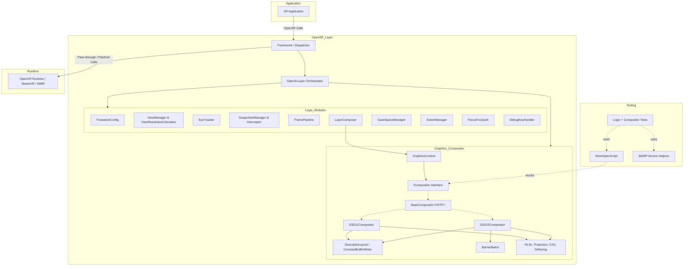

# Quad-Views-Foveated Architecture

This document provides a high-level architectural overview of the **Quad-Views-Foveated** OpenXR API Layer. It outlines the system's purpose, core components, module responsibilities, and the execution flow of a rendered frame.

## 1. System Overview

The Quad-Views-Foveated layer is an OpenXR API layer that intercepts OpenXR calls between a VR application and the OpenXR runtime. Its primary purpose is to emulate Varjo-style Quad-Views (peripheral + focus views) and foveated rendering on runtimes that do not natively support it (e.g., SteamVR, Windows Mixed Reality).

It achieves this by:
1. Advertising `XR_VARJO_quad_views` and `XR_VARJO_foveated_rendering` extensions to the application (and implicitly requesting `XR_EXT_eye_gaze_interaction` / `XR_FB_eye_tracking_social` from the runtime).
2. Intercepting view configuration and resolution requests to divide the standard stereo views into 4 views (2 peripheral, 2 focus).
3. Intercepting `xrEndFrame` to composite the lower-resolution focus views into the high-resolution peripheral views using custom D3D11/D3D12 shaders, applying optional CAS sharpening and edge dithering.

## 2. High-Level Architecture Diagram

## 3. Core Components

### 3.1 Framework & Dispatch (`/framework`)
The outermost layer of the DLL. It handles the OpenXR loader negotiation (`xrNegotiateLoaderApiLayerInterface`) and auto-generates the dispatch tables (`dispatch.gen.cpp/h`) that forward OpenXR calls to the core layer or down to the runtime.
* **`entry.cpp`**: DLL entry point, logging initialization, path resolution. Sets `g_isUnloading = true` during `DLL_PROCESS_DETACH` *before* static destructors run so the compositor can skip GPU sync on teardown.
* **`dispatch.cpp`**: Handles `xrCreateApiLayerInstance`, extension filtering, and runtime quirk detection. Includes a **Vive runtime workaround**: a dummy instance used to probe extensions is intentionally leaked (the Vive runtime crashes if it is destroyed mid-init) and tracked in `g_leakedDummyInstance` for later cleanup.
* **`dispatch.gen.cpp/h`**: Auto-generated wrappers that forward OpenXR calls into the singleton `OpenXrLayer`. Every wrapper is wrapped in a `try/catch(std::exception&)` so unexpected exceptions are converted into `XR_ERROR_RUNTIME_FAILURE` rather than crashing the host process.
* **`log.h/util.h`**: Centralized, level-gated logging and TraceLogging providers. The `QVF_TRACE*` macros are guarded by `IsTraceEnabled()` so argument evaluation is skipped entirely when no trace session is attached — this is critical for both production performance and unit testing.

### 3.2 Layer Core (`layer.cpp/h`)
The `OpenXrLayer` class inherits from the generated `OpenXrApi` base class. It acts as the central orchestrator. Every intercepted OpenXR function lives here, but instead of containing business logic, it delegates to specialized "Manager" classes.

The layer also coordinates an **ordered teardown sequence** in `xrDestroySession`:
1. `FramePipeline::destroy()` — wait for any in-flight async (turbo) frames.
2. Acquire the frame mutex to block any lingering async work.
3. `ICompositor::waitForGpuIdle()` — drain the GPU before destroying swapchains.
4. `SwapchainManager::destroyAllFullFovSwapchains()` — explicit cleanup while the session is still valid.
5. `GraphicsContext::destroy()` — destroys the compositor.
6. `GazeSpaceManager::clear()`.
7. Finally call the base `xrDestroySession`.

This ordering prevents use-after-free races between layer-created full-FOV swapchains, the compositor's cached GPU resources, and the OpenXR session handle.

### 3.3 Logic Modules (`/logic`)
These classes contain the headless, non-graphics business logic of the layer. They are injected into the `OpenXrLayer` as member variables.
* **`FoveationConfig`**: Parses `settings.cfg`. Supports per-application (`[app:...]`, `[exe:...]`), per-runtime, and per-system configurations. Includes validation, clamping, and parsing of 1-Euro filter parameters (`eye_tracking_min_cutoff`, `eye_tracking_beta`), dithering (`dithering_amount`), and log level.
* **`ViewManager` & `ViewResolutionCalculator`**: `ViewManager` computes the FOV boundaries for the focus views based on eye gaze, config multipliers, and edge-widening deadzones. FOV tables are populated lazily on the **first valid `xrLocateViews` call** (avoids dummy frame loops that crash strict runtimes). `ViewResolutionCalculator` computes the recommended pixel resolutions for the 4 views (quad views) or scaled stereo views (FOV tangent mode).
* **`EyeTracker`**: Abstracts eye-tracking data. Supports FB Eye Tracking, EXT Eye Gaze Interaction, and Simulated Tracking (mouse). Implements a 1-Euro filter for gaze smoothing with forward prediction scaled by the runtime's predicted display period. Includes **health monitoring**: `noteGoodEyeTrackingData`, `resetEyeTrackingHealth`, and a self-latching `consumeStaleTrackingWarning()` that fires a warning exactly once per outage. Caches the last good gaze vector with a configurable timeout so transient dropouts (e.g. blinks) do not cause warping.
* **`SwapchainManager` & `SwapchainInterceptor`**: Tracks all swapchains created by the application. `getSwapchain` now returns a `shared_ptr<Swapchain>` so the swapchain outlives the frame composition even if the application destroys it concurrently. Manages the creation of internal "full-FOV" array swapchains (`arraySize=2`, shared by both eyes to work around SteamVR D3D12 limits). Handles the Varjo deferred-release quirk. `untrackSwapchain` calls `OpenXrApi::xrDestroySwapchain` *directly* to bypass the layer's override and avoid recursive mutex locking.
* **`FramePipeline`**: Manages the `xrWaitFrame`/`xrBeginFrame`/`xrEndFrame` loop. Implements "Turbo Mode" using a **persistent background worker thread** (replacing per-frame `std::async`) that pipelines the wait. Worker thread checks for `XR_ERROR_SESSION_LOST` to break out cleanly. `destroy()` uses a 5-second timeout when joining the worker to prevent infinite hangs. Also owns CPU/GPU frame timers (`ITimer`, `IGraphicsTimer`).
* **`LayerComposer`**: Processes the composition layers passed to `xrEndFrame`. It patches the application's projection layers to point to the layer's composited full-FOV swapchains. Implements **graceful degradation**: if the compositor fails to initialize (e.g. shader compilation failure), it sets `m_compositorFailed` and passes frames through unmodified for the rest of the session.
* **`GazeSpaceManager`**: Intercepts `xrCreateReferenceSpace` to handle `XR_REFERENCE_SPACE_TYPE_COMBINED_EYE_VARJO`, allowing apps to query gaze spaces even if the runtime doesn't natively support them. Uses a mutex-protected `std::set<XrSpace>`.
* **`ActionManager`**: Automatically injects the layer's eye-tracker action set into the application's action bindings if the app forgets to poll/sync actions. Handles `xrAttachSessionActionSets` and `xrSyncActions` injection, plus a `pollAndSyncIfNeeded` fallback that fires after a 100-frame grace period and force-polls `xrPollEvent` for apps that never advance the event queue.
* **`FocusFovQuirk`**: A workaround for DCS World. Caches correct focus view FOVs during `xrLocateViews` (keyed by `XrTime`) and looks them up during `xrEndFrame` because the app sends invalid FOVs in the end frame call. Old entries are aged out after 1 second via `ageOldEntries`.
* **`DebugKeyHandler`**: Runtime config tweaks via Ctrl+key combinations (sharpening, smoothing, offsets, widening multipliers) — useful for live tuning without restarting the app.

### 3.4 Graphics & Compositor (`/compositor*, /utils`)
Handles the actual GPU rendering. The graphics-specific logic is now organized around a **CRTP base class** so that the shared orchestration lives in one place and the API-specific work is dispatched via narrow hooks.

#### `ICompositor` (interface, `compositor.h`)
Pure virtual interface defining `initialize`, `compositeView`, `destroy`, `isInitialized`, `evictSwapchainState`, and `waitForGpuIdle`. `evictSwapchainState` is called when a swapchain is destroyed so the compositor can release any acquired full-FOV images and drop cached graphics state. `waitForGpuIdle` is used during teardown and swapchain destruction to avoid use-after-free races.

#### `BaseCompositor<DerivedT, StateT>` (`compositor_base.h`)
CRTP base class that owns:
* The shared `m_swapchainStates` map (`std::unordered_map<XrSwapchain, std::shared_ptr<StateT>>`) and its mutex — previously duplicated in each compositor.
* `getOrCreateSwapchainState()` — thread-safe lookup.
* `evictSwapchainState()` — releases any held full-FOV image and erases the entry.
* Full-FOV swapchain lifecycle helpers: `acquireFullFovImage` (view 0), `releaseFullFovImage` (view 1), `evictFullFovImageIfHeld`. These centralize the acquire/wait/release state machine so D3D11 and D3D12 stay in sync and the OpenXR contract is never violated.
* `compositeView()` — the **pipeline orchestrator**. It runs five stages, each dispatching to a narrow CRTP hook:
  1. `acquireAndResolveImages` — acquire the destination (full-FOV) image, resolve source textures from the cached swapchain image arrays.
  2. `flattenImages` — flatten source sub-rects into standalone 2D textures (orchestrated in the base; `BindDirectSource` / `NeedsFlatReallocate` / `CreateFlatImage` / `CopySubImage` are the API-specific hooks).
  3. `sharpenFocusView` — conditional CAS compute pass.
  4. `renderProjection` — full-screen triangle projection/blending pass.
  5. `cleanupAndRelease` — unbind resources, restore barriers, release the full-FOV image (view 1 only).
* `NeedsReallocate()` — CRTP-dispatched texture size/format check that drives `CreateFlatImage` / `sharpenedImage` reallocation.

The base class also exposes `SwapchainGraphicsStateBase` — a common base for per-swapchain graphics state that holds the full-FOV lifecycle fields, so D3D11/D3D12 only add their own API-specific fields.

#### `D3D11Compositor` (`d3d11_compositor.*`)
Implements the CRTP hooks for D3D11. Notable details:
* Aggressively caches SRVs/UAVs/RTVs per swapchain state. RTV cache is now `std::vector<ComPtr<ID3D11RenderTargetView>>[StereoView::Count]` indexed by `acquiredFullFovImageIndex` (replaces an earlier `thread_local` that could dangle).
* Uses a **`D3D11_QUERY_EVENT` (`m_frameEndQuery`)** issued at the end of the projection draw. `waitForGpuIdle()` flushes the context and blocks on `GetData` with `SwitchToThread()` polling so the CPU truly waits for GPU completion (previous implementation could return before the GPU finished).
* Carefully nulls CS SRVs/UAVs after the sharpening pass so the sharpened texture can be bound as a PS SRV in the projection pass (D3D11 otherwise nullifies the SRV).
* All `destroy()` and `waitForGpuIdle()` paths early-out when `g_isUnloading` is set.

#### `D3D12Compositor` (`d3d12_compositor.*`)
Implements the CRTP hooks for D3D12. Notable details:
* **Triple-buffered descriptor heaps** (`kFrameCount = 3`): one CBV/SRV/UAV heap per frame per eye, plus a non-shader-visible CPU cache heap and a separate RTV heap. Slot assignments are encoded in `DescriptorLayout` (compile-time-checked via `static_assert`) so VS/PS CBVs, stereo/focus/blank SRVs, and sharpen SRV/UAV/CBV all have stable slots.
* **`ConstantBufferWriter`**: wraps a persistently-mapped upload heap and writes typed VS/PS constants into 256-byte-aligned per-eye slots. The CBV descriptors are pre-created at initialization.
* **Per-state CPU descriptor heap** for caching SRV/UAV descriptors on the focus swapchain state, avoiding per-frame `CreateShaderResourceView`/`CreateUnorderedAccessView` calls. Cached descriptors are copied into the GPU-visible heap via `CopyDescriptorsSimple`.
* **Double-buffered command lists** (`m_cmdList[viewIndex][2]`) to avoid per-frame `CreateCommandList` overhead. `resetCommandList()` throws a `std::runtime_error` (with `DeviceRemovedReason` in the message) on failure so the dispatcher's `catch(std::exception&)` can convert it cleanly — previously `CHECK_HRCMD` would terminate the process.
* **Sharpened texture format is `DXGI_FORMAT_R32G32B32A32_FLOAT`** (not `R16G16B16A16_FLOAT`). The 16-bit format caused GPU device-removed crashes on some drivers when the CAS shader wrote float4 values exceeding the 16-bit range with HDR content.
* **`BarrierBatch`** (`utils/d3d12_helpers.h`): batches up to 8 resource barriers and **auto-filters no-op transitions** (where `BeforeState == AfterState`). No-op barriers cause `cmdList->Close()` to return `E_INVALIDARG` on SteamVR's D3D12 runtime.
* **Fence-based GPU sync** with a 5-second timeout in both `waitForGpuIdle()` and `destroy()` to prevent infinite hangs if the GPU stops responding.
* View 0 issues `waitForPreviousFrame` and resets its command allocator/list; view 1 closes, executes, signals the fence, and waits.

#### `compositor_shared.h`
Shared math and constant-buffer layout. Now includes:
* **Compile-time layout locks**: `static_assert` on the byte size of `ProjectionVSConstants` (112), `ProjectionPSConstants` (96), and `SharpeningCSConstants` (32). Any accidental field reorder/type change/alignment shift is caught at compile time rather than silently corrupting GPU shader output.
* `NeedsFlattening()` — returns true when a sub-image region does not cover the full swapchain at array index 0.
* `SharpeningPass` — computes CAS dispatch dimensions and prepares CAS constants.
* `ComputeProjectionConstants` / `ComputePixelShaderConstants` / `ComputeCasConstants` — guarantee byte-identical constant buffer contents between D3D11 and D3D12.

#### Shaders (`ProjectionVS/PS.hlsl`, `ProjectionPS11.hlsl`, `SharpeningCS.hlsl`, `SharpeningCS11.hlsl`)
* `ProjectionVS.hlsl` (SM 6.0) / `ProjectionVS11.hlsl` (SM 5.0, `#include`s the SM 6.0 file): full-screen triangle vertex shader that projects focus-view coordinates.
* `ProjectionPS.hlsl`: blends peripheral and focus views with edge smoothing, alpha handling, and now **Interleaved Gradient Noise dithering** in the transition zone (offset by `frameCount` to rotate temporally and reduce shimmer). Also feathers CAS sharpening at focus view edges so the resolution boundary is less visible.
* `SharpeningCS.hlsl`: AMD FidelityFX CAS compute shader. Compiles to both SM 5.0 and SM 6.0 via `ffx_a.h` / `ffx_cas.h`. Writes `float4` to a `RWTexture2D<float4>` (hence the R32G32B32A32 format requirement).

#### `GraphicsContext` (`logic/graphics_context.*`)
Detects the application's graphics API (D3D11 or D3D12) from the session create-info chain, initializes the correct compositor, and:
* For D3D11: creates a switchable `ID3DDeviceContextState` so the layer can swap the immediate context between the app's state and the layer's state during composition (D3D12 needs no equivalent because it uses command lists).
* Creates CPU/GPU timers via the `utils::graphics` abstraction for frame statistics. The timers are transferred to `FramePipeline` after initialization.

## 4. Execution Flow: The Frame Loop

1. **`xrWaitFrame`**:
   * `FramePipeline` intercepts this. In Turbo Mode, the persistent worker thread performs the actual `xrWaitFrame` call asynchronously. On the first poll the layer returns a predicted display time immediately (allowing the app to start rendering earlier); on the second poll it blocks on the future to ensure the wait has completed. The worker breaks out cleanly on `XR_ERROR_SESSION_LOST`.
2. **`xrBeginFrame`**:
   * `FramePipeline` handles this. In async mode it is a no-op (the begin is deferred to `xrEndFrame`). `ActionManager::pollAndSyncIfNeeded` runs after the grace period to attach/sync the eye-tracker action set if the app hasn't. A stale-tracking warning is emitted if no eye data has arrived in 60 seconds.
3. **`xrLocateViews`**:
   * `ViewManager` intercepts the stereo views, splits them into 4 views, and computes the foveated FOV for the focus views based on `EyeTracker` gaze data. On the first valid call, FOV tables are lazily populated. `FocusFovQuirk` caches the focus FOVs keyed by display time if enabled.
4. **`xrAcquireSwapchainImage` / `xrReleaseSwapchainImage`**:
   * `SwapchainInterceptor` tracks image indices and handles deferred releases if required by the runtime. Acquired indices are pushed onto a per-swapchain deque; `lastReleasedIndex` is updated when an image is released.
5. **`xrEndFrame`** (the heavy lifting):
   * `GraphicsContext` swaps the D3D11 device context to the layer's state (D3D12 skips this).
   * `LayerComposer::processLayers` walks the submitted layers. For each eye, it asks the `ICompositor` to `compositeView`. The compositor's `BaseCompositor` orchestrator runs the 5-stage pipeline (acquire → flatten → sharpen → project → cleanup) via CRTP hooks.
   * `LayerComposer` patches the `XrCompositionLayerProjectionView` structs to point to the new full-FOV swapchain (clearing the `UNPREMULTIPLIED_ALPHA` flag because the shader always premultiplies).
   * `GraphicsContext` restores the application's D3D11 device context (via a `MakeScopeGuard` so it happens even on early return).
   * `FramePipeline::endFrame` calls the base `xrEndFrame` to submit the patched layers. If Turbo Mode is on and no async wait is in flight, it signals the worker thread to start the next frame's wait.
6. **`xrDestroySession`**:
   * Runs the ordered teardown sequence described in §3.2: drain async frames → lock frame mutex → `waitForGpuIdle` → destroy full-FOV swapchains → destroy graphics context → clear gaze spaces → base `xrDestroySession`. This explicit ordering is what makes the layer safe to unload and reload.

## 5. Key Architectural Patterns

* **CRTP for Shared Orchestration**: `BaseCompositor<DerivedT, StateT>` centralizes the `compositeView` pipeline, the swapchain-state map, and the full-FOV lifecycle. D3D11/D3D12 implement only narrow, intention-revealing hooks (`acquireAndResolveImages`, `BindDirectSource`, `sharpenFocusView`, `renderProjection`, etc.). This eliminates ~300 lines of duplicated orchestration while keeping API-specific code isolated. The trade-off — `friend BaseCompositor<...>` declarations in the derived classes — is accepted because the friendship is narrow and one-directional.
* **Dependency Injection**: The `OpenXrLayer` class instantiates all manager classes and passes references/pointers to them as needed. `LayerComposer` receives references to `ViewManager`, `SwapchainManager`, `GraphicsContext`, `EyeTracker`, `Config`, and `FocusFovQuirk` without owning them.
* **Interface Segregation**: Graphics logic is completely isolated behind `ICompositor`. The `LayerComposer` has no idea whether it is talking to D3D11 or D3D12.
* **Compile-Time Layout Locks**: Constant-buffer structs and the D3D12 descriptor layout are guarded by `static_assert`s so any drift between C++ and HLSL is caught at build time, not at runtime as visual corruption.
* **Aggressive Descriptor/View Caching**: Both compositors cache SRVs/UAVs/RTVs per swapchain state (D3D11) or per-state CPU heaps + GPU-heap slots (D3D12) to avoid per-frame descriptor creation. The D3D12 path pre-creates VS/PS CBV descriptors at init and uses `CopyDescriptorsSimple` to populate per-frame SRV/UAV slots.
* **Graceful Degradation**: If the compositor fails to initialize or returns null mid-frame, `LayerComposer` sets `m_compositorFailed` and passes frames through unmodified, ensuring the headset doesn't black-screen.
* **Explicit Lifetime Management with `shared_ptr`**: `SwapchainManager::getSwapchain` returns `shared_ptr<Swapchain>` so a swapchain cannot be destroyed while `LayerComposer` is mid-composition. The full-FOV swapchain is destroyed via `OpenXrApi::xrDestroySwapchain` (qualified base call) to avoid re-entering the layer's override.
* **Safe Trace Macros**: `QVF_TRACE*` macros guard both argument evaluation and the ETW API call behind `IsTraceEnabled()`. This is essential for unit testing (where the trace provider may not be registered) and for production performance.

## 6. Testing Infrastructure

The `tests/` directory contains a GTest/GMock suite organized around the testing seam policy below.

* **`MockOpenXrApi`**: A `gmock`-based mock that inherits from `OpenXrApi`. `initializeForTesting()` populates the base-class dispatch table via three `setDispatchTableForTesting*` helpers (frame loop, swapchain, and spaces/actions/events). This is what makes qualified base-class calls like `openXrApi->OpenXrApi::xrWaitFrame(...)` forward to the mock instead of dereferencing null function pointers. The mock also includes a `MockSwapchain` registry and `SetupWarpSwapchainMocks()` so the compositor can be exercised against real WARP textures without a real OpenXR runtime.
* **`WarpHelpers.h`**: Creates D3D11 and D3D12 WARP devices + immediate context / command queue. Used by `TestCompositorWarp.cpp` to run the full `compositeView` pipeline (including CAS sharpening) on the Microsoft Basic Render Driver, catching barrier/PSO/descriptor bugs that pure mocks would miss.
* **`LayerStubs.cpp`**: Stubs out the layer's `GetInstance()`, `dllHome`, `localAppData`, `logStream`, and `advertisedExtensions` so the test executable can link without pulling in `entry.cpp` / `layer.cpp`.
* **`tests/pch.h` + `tests.cpp`**: Mirror the layer's PCH, declare `g_isUnloading` for the test build, and register/unregister the trace provider in a global test environment so `TraceLoggingWrite` doesn't crash.
* **Test coverage**: logic tests for `ViewManager`/`ViewResolutionCalculator`/`EyeTracker`/`ActionManager`/`FocusFovQuirk`/`GazeSpaceManager`/`SwapchainManager`/`FramePipeline`/`Config`; layout tests for the constant-buffer structs; shared-logic tests for `NeedsFlattening` and `SharpeningPass`; a CRTP-base test (`TestCompositorBase.cpp`) that exercises `NeedsReallocate`, `getOrCreateSwapchainState`, `evictSwapchainState`, and the full-FOV lifecycle against a `MockCompositor`; an end-to-end logic test that wires `ViewManager` + `EyeTracker` + `ViewResolutionCalculator` + `FramePipeline` together; and WARP-based compositor tests parameterized over D3D11/D3D12.

## 7. Testing Seam Policy

Tests should exercise logic through public APIs or small, documented `*ForTesting` methods.

* **Do not add `friend class ...Test` to production headers.** Friendship grants access to *every* private member, coupling the test suite to internal implementation details and making refactors fragile.
* **Preferred approaches** (in order):
  1. Test through the existing public API.
  2. Add a minimal, intention-revealing `*ForTesting` method (e.g. `seedFilterStateForTesting()`, `setEyeTrackerActionSetForTesting()`, `setDispatchTableForTesting*()`).
  3. Extract pure logic to a free function that takes inputs as parameters (e.g. `NeedsFlattening`, `SharpeningPass`, `ComputeProjectionConstants`).
  4. As a last resort, add a single narrow accessor struct for one logical group of state.
* **Rationale:** Narrow seams are auditable, self-documenting, and survive refactors. They also double as production reset/seed methods where appropriate (e.g. filter state seeding on session restart, `resetEyeTrackingHealth()` on session state change).
* **Mock dispatch table is a permitted seam:** The `setDispatchTableForTesting*` methods on `OpenXrApi` are the canonical way to wire a `MockOpenXrApi` into the layer's qualified base-class calls. They populate real function-pointer fields, so they are also useful for any non-test caller that wants to redirect a subset of OpenXR calls.

## 8. Defensive Teardown

A global `g_isUnloading` flag is set in `DllMain` during `DLL_PROCESS_DETACH` *before* static destructors run. Because the OpenXR runtime and D3D devices might be torn down before the layer's static destructors execute, the compositor checks this flag in `destroy()` and `waitForGpuIdle()` to skip GPU synchronization and resource release during process exit, preventing crashes. The OS reclaims all memory on exit anyway.

The `xrDestroySession` path (§3.2, §4.6) is the *in-process* counterpart: it performs an explicit, ordered cleanup that is safe to invoke at any time during the session's lifetime, not just at process exit. Together, these two mechanisms ensure the layer can be unloaded mid-session (e.g. by the OpenXR loader) without leaving dangling GPU resources or deadlocking on a runtime that is already gone.